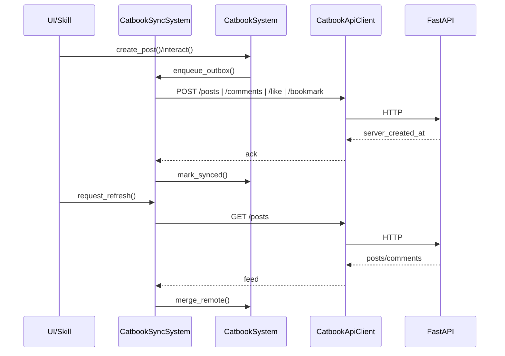

# 小喵书跨玩家同步 - 实现方案（最终 + 开发规划）

## 目标
- 实现小喵书跨玩家同步：不同玩家的猫猫发布的帖子、评论、点赞、收藏能够互相可见。
- 保证 post/comment/like/bookmark 的幂等上行与跨端一致排序。

## 关键决策
- 幂等：客户端生成 `post_id/comment_id` 作为最终 ID，服务端接受并以此去重。
- 时间：新增 `server_created_at`（UTC 时间戳）作为跨端排序主键。
- 身份：作者 ID 统一为 `"{actor_id}@{user_id}"`。`user_id` 使用 `src/core/llm.py:get_user_uuid()`。
- 无签名/鉴权。

---

## 架构总览

### 客户端
- `CatbookSystem`：只做领域状态（post/comment/like/bookmark、排序、统计、事件），不做 HTTP。
- `CatbookSyncSystem`：异步联机（outbox、拉取、重试/退避、节流）。
- `CatbookApiClient`：封装 `https://api.meowuisland.com/api` 的 HTTP 调用。
- `CatbookSyncState`：持久化 outbox、last_cursor、last_sync 等同步状态。

### 服务端
- FastAPI + PostgreSQL，接收客户端生成的 post_id/comment_id，并返回 `server_created_at`。
- 使用现有对外域名 `https://api.meowuisland.com`，新增路径前缀 `/api/catbook`。

---

## 后端架构（FastAPI + PostgreSQL）

### 新增文件（已对齐新项目结构）
- `app/api/routes/catbook.py`：Catbook API 路由入口（前缀 `/api/catbook`）。
- `app/services/catbook_service.py`：业务逻辑（幂等写入、查询、分页）。
- `app/db/postgres.py`：数据库连接/Session 管理。
- `app/models/catbook.py`：SQLAlchemy ORM 模型：
  - `Post`（主键 `post_id`）
  - `Comment`（主键 `comment_id`）
  - `Like`（唯一键 `post_id + actor_global_id`）
  - `Bookmark`（唯一键 `post_id + actor_global_id`）
  - `Topic`
- `app/schemas/catbook.py`：Pydantic 请求/响应：
  - `PostCreate`, `PostResponse`（含 `server_created_at`）
  - `CommentCreate`, `CommentResponse`（含 `server_created_at`）
  - `InteractionRequest`（like/bookmark）
  - `SyncRequest`, `SyncResponse`
  - `FeedResponse`（posts+comments+cursor）

### API 设计（与客户端一致）
统一前缀：`/api/catbook`
- `GET /posts`：拉取最新帖子（分页/游标）
- `POST /posts`：创建帖子（幂等，post_id 为主键）
- `GET /posts/{post_id}`：单帖详情
- `GET /posts/{post_id}/comments`：拉评论
- `POST /posts/{post_id}/comments`：创建评论（幂等，comment_id 为主键）
- `POST /posts/{post_id}/like`：点赞（幂等，唯一键）
- `POST /posts/{post_id}/bookmark`：收藏（幂等，唯一键）
- `POST /sync`：批量上行（可选）
- `GET /topics/hot`：热门话题

### 幂等约束（数据库）
- `posts.post_id` 唯一
- `comments.comment_id` 唯一
- `likes(post_id, actor_global_id)` 唯一
- `bookmarks(post_id, actor_global_id)` 唯一

---

## 客户端设计

### 新增模块
- `src/systems/catbook_api_client.py`：HTTP 封装（单向 IO）
- `src/systems/catbook_sync_system.py`：异步同步（outbox + refresh）
- `src/schemas/catbook_sync.py`：同步状态与 outbox 结构

### 保留模块
- `src/systems/catbook_system.py`：只处理本地状态与规则

---

## 最小接口定义

### CatbookApiClient
- `create_post(post: CatbookPostUpsert) -> CatbookPostAck`
- `create_comment(comment: CatbookCommentUpsert) -> CatbookCommentAck`
- `create_like(post_id: str, actor_id: str) -> InteractionAck`
- `create_bookmark(post_id: str, actor_id: str) -> InteractionAck`
- `fetch_feed(cursor: Optional[str], limit: int) -> CatbookFeed`

### CatbookSyncSystem
- `enqueue_outbox(item: CatbookOutboxItem) -> None`
- `request_refresh(reason: str) -> None`
- `update() -> None`（主线程消费回包，合并本地）

---

## ID 生成与作者格式

### 函数签名
```python
def build_post_id(user_id: str) -> str:
    """Return p_{user_id}_{uuid4hex}."""

def build_comment_id(user_id: str) -> str:
    """Return c_{user_id}_{uuid4hex}."""
```

### 作者 ID
- `author_id = f"{actor_id}@{user_id}"`
- `user_id = get_user_uuid()`

---

## Outbox 数据结构（具体字段定义）
```python
from typing import Literal, Optional, Dict, Any
from pydantic import BaseModel

class CatbookPostUpsert(BaseModel):
    post_id: str
    author_id: str
    title: str
    content: str
    text: str
    image_id: Optional[str] = None

class CatbookCommentUpsert(BaseModel):
    comment_id: str
    post_id: str
    author_id: str
    content: str
    parent_comment_id: Optional[str] = None

class CatbookInteractionUpsert(BaseModel):
    post_id: str
    actor_id: str
    action: Literal["like", "bookmark"]

class CatbookOutboxItem(BaseModel):
    kind: Literal["post", "comment", "like", "bookmark"]
    entity_id: str              # post_id/comment_id 或 (post_id+actor_id+action) 的稳定键
    payload: Dict[str, Any]     # 对应 Upsert 的 model_dump()
    status: Literal["pending", "in_flight", "retry_wait", "dead"] = "pending"
    attempt: int = 0
    created_at: float
    next_retry_at: float = 0.0
    last_error: Optional[str] = None
```

---

## 同步状态机（草图）

### 写入（outbox item）
```
PENDING -> IN_FLIGHT -> SUCCESS -> DONE
                    -> RETRYABLE_ERROR -> WAIT_RETRY -> PENDING
                    -> FATAL_ERROR -> DEAD
```

### 拉取
```
IDLE -> FETCHING -> APPLY -> IDLE
(节流：FETCHING/冷却中合并请求)
```

---

## 数据模型变更清单

### `src/schemas/catbook.py`
- `CatbookPost`
  - 新增：`server_created_at: Optional[int] = None`
- `CatbookComment`
  - 新增：`server_created_at: Optional[int] = None`
- `author_id` 语义统一：`cat_id@user_id` / `player@user_id`

### 新增 `src/schemas/catbook_sync.py`
- `CatbookOutboxItem`
- `CatbookSyncState`

---

## 前端触发点（同步拉取）
- 玩家打开小喵书 UI：`CatbookSyncSystem.request_refresh("ui_open")`
- 猫猫 `use_mode(catbook)`：进入 catbook 时拉取
- 猫猫 `catbook_browse`：执行前拉取

---

## 合并与排序规则
- `CatbookSystem.merge_remote()`：以 `post_id/comment_id` 合并；已有则补齐 `server_created_at`，以服务端为准更新计数。
- 排序优先使用 `server_created_at`，缺失回退 `timestamp`。

---

## 存档与恢复
- `CatbookSyncState` 需要序列化到存档（GameState 持有）。
- outbox 在重启后继续重试，确保离线期间操作最终同步。

---

## 数据流（示意）


---

## 开发规划（后端优先）

### Milestone 0：准备
- 确认数据库：PostgreSQL 为 Catbook 主库（与现有监控栈同一 Compose）
- 统一入口：Catbook 路由挂载至 `app/main.py`，路径前缀 `/api/catbook`
- 依赖安装：`sqlalchemy`, `psycopg2-binary`（如需），`pydantic`

### Milestone 1：数据模型与迁移
- 在 `app/models/catbook.py` 建立 ORM 模型
- 建立唯一约束：`post_id`、`comment_id`、`(post_id, actor_global_id)` for like/bookmark
- 增加基础索引：`server_created_at`、`post_id`、`author_id`
- 编写初始化 SQL（或后续接入 Alembic）

### Milestone 2：核心写接口（幂等）
- `POST /posts`：基于 `post_id` 幂等 upsert
- `POST /posts/{post_id}/comments`：基于 `comment_id` 幂等 upsert
- `POST /posts/{post_id}/like` / `bookmark`：基于唯一键幂等
- 返回 `server_created_at`（新创建时生成，已存在则返回已有）

### Milestone 3：读取接口与分页
- `GET /posts`：支持 cursor + limit（按 `server_created_at` 倒序）
- `GET /posts/{post_id}`：单帖详情
- `GET /posts/{post_id}/comments`：按 `server_created_at` 排序
- `GET /topics/hot`：先返回空实现或简单聚合，后续迭代

### Milestone 4：批量 Sync 接口（可选）
- `POST /sync` 支持 posts/comments/likes/bookmarks 批量 upsert
- 返回批量 ack（含 `server_created_at`）

### Milestone 5：可观测性与稳定性
- 统一日志格式，打印请求量与错误率
- 增加简单的健康检查指标（可复用 `/api/health`）
- 可选：增加超时与重试策略（仅服务端）

## 验收清单（后端）
- 幂等：重复创建不新增记录，`server_created_at` 不变化
- 排序：feed 按 `server_created_at` 排序一致
- 兼容：现有 `/chat/completions` 等路径不受影响
- 路由：`/api/catbook/*` 可访问
